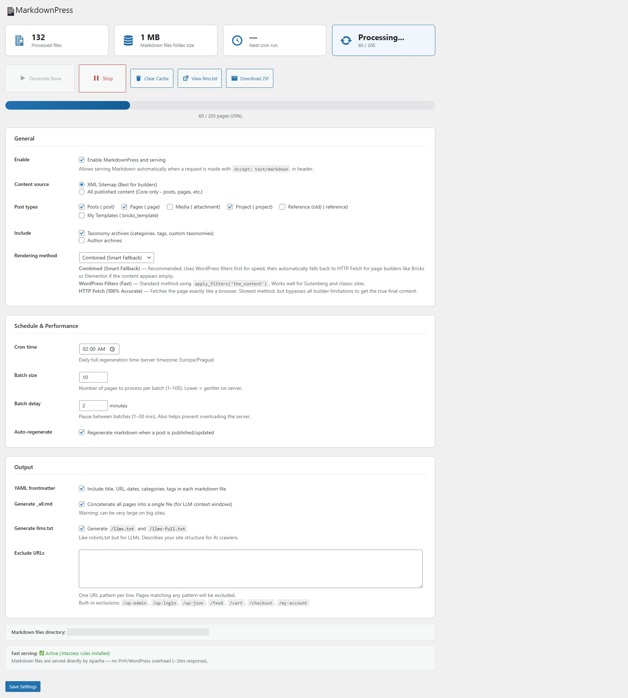

# MarkdownPress

Generates a Markdown mirror of your entire WordPress site for AI/LLM consumption. Serves content via `Accept: text/markdown` header and generates `llms.txt`.



## Description

MarkdownPress automatically generates Markdown versions of all your WordPress content and serves them to AI crawlers and LLM tools.

### Features

- **Converts all content**: Published posts, pages, and custom post types to clean Markdown.
- **Full support**: Taxonomy archives, author pages, and the homepage.
- **Page Builder compatible**: Works with Gutenberg, Elementor, Bricks, WPBakery, Divi, etc.
- **AI Standards**: Generates `llms.txt` and `llms-full.txt` (the "robots.txt for AI").
- **Instant serving**: Via `Accept: text/markdown` HTTP header or `?format=markdown` URL parameter.
- **Performance**: Smart batch processing via WP Cron to prevent server overload.
- **Dynamic**: Regenerates markdown automatically when posts are saved.
- **Admin Dashboard**: Real-time stats, progress bar, and manual triggers.
- **Rich Meta**: YAML frontmatter including featured images, categories, and tags.
- **Security**: URL exclusion list for sensitive pages.
- **Advanced Output**: Generates `_all.md` (entire site in one file) and `_sitemap.md`.

## How it works

1. **Queueing**: The plugin queues all content for processing (manually or on schedule).
2. **Processing**: Items are processed in small batches to preserve server resources.
3. **Conversion**: Pages are rendered through WP filters (to resolve shortcodes) and converted to Markdown.
4. **Caching**: Files are stored in `wp-content/markdownpress/`.
5. **Direct Serving**: When requested via headers, the cached file is served instantly by the server.

## File structure

```text
wp-content/markdownpress/
├── index.md                  # homepage
├── about/
│   └── index.md
├── blog/
│   ├── my-post/
│   │   └── index.md
├── _sitemap.md               # list of all pages
├── _all.md                   # complete site content
├── llms.txt                  # compact site overview
└── llms-full.txt             # full content for LLMs
```

## Installation

1. Upload the `markdownpress` folder to `/wp-content/plugins/`
2. Activate the plugin through the **Plugins** menu in WordPress.
3. Go to **Settings → MarkdownPress** to configure.
4. Click **Generate Now** to build your first cache.

## FAQ

#### Does it work with Elementor / Bricks / etc.?
Yes. It uses `apply_filters('the_content')`. If you see missing content, switch the rendering method to "HTTP fetch" in settings.

#### How do I access markdown content?
- Add `?format=markdown` to any URL.
- Send the `Accept: text/markdown` HTTP header.

#### What is llms.txt?
An emerging standard for describing your website to AI tools (see [llmstxt.org](https://llmstxt.org)).

## Changelog

### 1.2.4
- Integrated self-hosted update system (`plugin-update-checker`).
- Added standard `index.php` security files to all directories.
- Updated documentation: Only admin settings are stored in the database; no generation data is kept there, making cleanup easy (just delete the cache folder).

### 1.2.3
- Forced absolute URLs for all images in Markdown output for better AI compatibility.

### 1.2.2
- Added "Stop Generation" button to halt active processing.
- Fixed button icon alignment in the admin interface.

## Technical Notes

- **Database**: The plugin stores **only** administrative settings and basic status in the `{wp_prefix}_options` table. No content or generation data is stored in the database.
- **Cleanup**: To completely remove all trace of generated content, simply delete the `wp-content/markdownpress/` directory.
- **Updates**: This plugin uses a self-hosted update server at `vyladeny-web.cz`.

### 1.2.1
- Added help text explaining how to serve Markdown via HTTP `Accept` header.

### 1.2.0
- Added Error Logging (`_errors.log`).
- Added "Download ZIP" feature.
- Added on-the-fly generation for missed cache items.
- Improved path matching and .htaccess rules.
- Renamed cache directory to `markdownpress`.

### 1.1.0
- Added support for Bricks, Elementor, and other page builders.
- Improved content rendering using combined PHP and HTTP fetch methods.
- Changed default content source to XML Sitemap.

### 1.0.0
- Initial release
